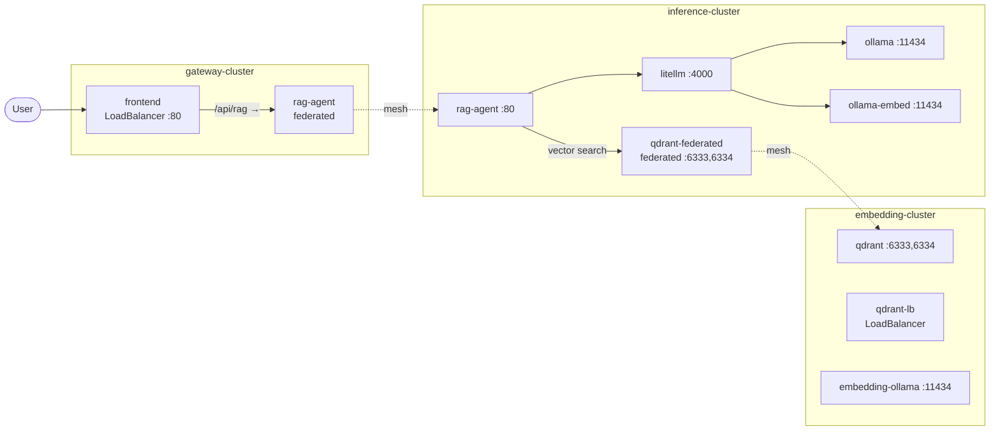

# RAG Setup Overview

Brief reference for this repo’s RAG application running across three AKS clusters with Calico cluster mesh. Use this when asking other LLM queries about this setup.

## High-level architecture

- **Three clusters**: `gateway-cluster`, `inference-cluster`, `embedding-cluster`.
- **Cross-cluster access**: Calico cluster mesh + **Calico federated services** (Tigera `federation.tigera.io/serviceSelector`). No Calico Ingress Gateway in this phase.
- **User entry point**: Gateway cluster exposes a **LoadBalancer** on the frontend; all API traffic is proxied to the RAG agent in the inference cluster.

---

## Architecture diagram (Mermaid)

Services only. Dashed lines are Calico federated service resolution (cross-cluster).



---

## Deployments and services per cluster

### Gateway cluster

| Namespace   | Workload type | Name        | Service (if any)     | Type          | Port(s) |
|------------|---------------|-------------|----------------------|---------------|---------|
| `gateway`  | Deployment    | `frontend`  | `frontend`           | LoadBalancer  | 80      |
| `inference`| —             | —           | `rag-agent` (federated) | ClusterIP | 80 → 8080 |
| `embedding`| —             | —           | *(none in gateway)*  | —             | —       |

- **Frontend**: Nginx serving static `index.html` (ConfigMap); single route `/api/rag/` → proxy to `rag-agent.inference.svc.cluster.local` (strip `/api/rag` prefix). All LLM and RAG traffic goes through the RAG agent.
- **Federated namespaces**: `inference` and `embedding` exist on the gateway cluster only for **federated service definitions**; no workloads run there.

### Inference cluster

| Namespace   | Workload type | Name          | Service              | Type      | Port(s)     |
|------------|---------------|---------------|----------------------|-----------|-------------|
| `inference`| Deployment    | `ollama`      | `ollama`             | ClusterIP | 11434       |
| `inference`| Deployment    | `ollama-embed`| `ollama-embed`       | ClusterIP | 11434       |
| `inference`| Deployment    | `litellm`     | `litellm`            | ClusterIP | 4000        |
| `inference`| Deployment    | `rag-agent`   | `rag-agent`          | ClusterIP | 80 → 8080   |
| `embedding` | —             | —             | `qdrant-federated` (federated) | ClusterIP | 6333, 6334 |

- **Ollama (LLM)**: phi3 for chat/completion; GPU node pool (`workload=llm`, toleration); PVC for models.
- **Ollama-embed**: nomic-embed-text only (CPU); used at **query time** for RAG. Separate from phi3.
- **LiteLLM**: Proxy in front of both Ollamas; exposes OpenAI-style `/v1/chat/completions` and `/v1/embeddings` on port 4000.
- **RAG agent**: Flask app — embed via LiteLLM, retrieve via `qdrant-federated.embedding.svc.cluster.local`, complete via LiteLLM; endpoints: `POST /query`, `POST /chat`, `GET /health`, `GET /`.
- **Federated namespace**: `embedding` on the inference cluster holds only the **qdrant-federated** service definition so the RAG agent can reach Qdrant in the embedding cluster over the mesh.

### Embedding cluster

| Namespace  | Workload type | Name              | Service           | Type        | Port(s)   |
|------------|---------------|-------------------|-------------------|-------------|-----------|
| `embedding`| Deployment    | `qdrant`          | `qdrant`          | ClusterIP   | 6333, 6334|
| `embedding`| Deployment    | `qdrant`          | `qdrant-lb`       | LoadBalancer| 6333, 6334|
| `embedding`| Deployment    | `embedding-ollama`| `embedding-ollama`| ClusterIP   | 11434     |
| `embedding`| CronJob       | `embedding-cronjob`| —                | —           | —         |

- **Qdrant**: Vector store; HTTP 6333, gRPC 6334; PVC for storage.
- **Embedding Ollama**: Serves nomic-embed-text for **batch** embedding (CronJob only). PVC for models.
- **Sample documents**: ConfigMap `sample-documents` with `doc1.txt`–`doc4.txt`.
- **Embedding CronJob**: Runs every 5 min; creates Qdrant collection `documents` (cosine, 768 dims) if missing; reads `.txt` from `/documents`, embeds via embedding-ollama, upserts into Qdrant.

---

## Calico federated services (multi-cluster communication)

Cross-cluster traffic uses **Calico federated services**. A federated service is a normal Kubernetes `Service` with the annotation:

```yaml
federation.tigera.io/serviceSelector: <label-selector>
```

Calico resolves this service to **endpoints in other clusters** that match the selector over the cluster mesh, so pods in one cluster can call another cluster’s workload by DNS name (e.g. `rag-agent.inference.svc.cluster.local`, `qdrant-federated.embedding.svc.cluster.local`).

### Federated services in this setup

| Cluster            | Namespace   | Service name      | Selector (backend)   | Used by |
|--------------------|------------|-------------------|-----------------------|---------|
| **gateway-cluster**| `inference`| `rag-agent`       | `app == "rag-agent"`  | Frontend (gateway) → RAG agent (inference) |
| **inference-cluster** | `embedding` | `qdrant-federated` | `app == "qdrant"`   | RAG agent (inference) → Qdrant (embedding) |

- **Gateway → inference**: On the gateway cluster, the `rag-agent` service in namespace `inference` is federated. It has no local endpoints; Calico routes traffic to the inference cluster’s `inference` namespace where the real `rag-agent` deployment and service live.
- **Inference → embedding**: On the inference cluster, the `qdrant-federated` service in namespace `embedding` is federated. It has no local Qdrant pods; Calico routes traffic to the embedding cluster’s `embedding` namespace where the real Qdrant deployment and `qdrant` service live.

The federated service’s **namespace and name** define the DNS name that callers use; the **selector** defines which workload in the mesh (any cluster) backs it.

---

## Data flow (summary)

1. **Batch indexing (embedding cluster)**: CronJob → embedding-ollama (nomic-embed-text) → Qdrant collection `documents`.
2. **RAG query**: User → Gateway (LoadBalancer) → Nginx `/api/rag/query` → RAG agent (inference) → LiteLLM embed → Qdrant (embedding, via federated) → LiteLLM completion (phi3) → response.
3. **Chat**: User → Gateway → Nginx `/api/rag/chat` → RAG agent → LiteLLM `/v1/chat/completions` (phi3).

---

## Apply/delete

From repo root:

- `make rag-apply` — apply to all three clusters  
  Or per cluster: `make rag-apply-gateway` | `rag-apply-inference` | `rag-apply-embedding`
- `make rag-delete` — delete from all (and per-cluster variants: `rag-delete-gateway`, etc.)

Kubeconfigs: `kubeconfigs/<cluster>.yaml`. Cluster mesh must be up (`make mesh`) before RAG works across clusters.

---

## Key file locations (manifests)

| Cluster   | Path                              | Contents |
|-----------|-----------------------------------|----------|
| **Gateway** | `gateway-cluster/manifests/`     | Namespaces (`gateway`, `inference`, `embedding`), frontend (config, nginx config, deployment, LoadBalancer service), `rag-agent` federated service. |
| **Inference** | `inference-cluster/manifests/`  | Namespaces (`inference`, `embedding`, `gateway`), NVIDIA device plugin, Ollama (phi3) + PVC + service, ollama-embed + PVC + service, LiteLLM config + deployment + service, RAG agent config + deployment + service, `qdrant-federated` service. |
| **Embedding** | `embedding-cluster/manifests/`  | Namespace `embedding`, Qdrant (deploy, PVC, ClusterIP + LoadBalancer services), embedding-ollama (deploy, PVC, service), sample-documents ConfigMap, embedding-script ConfigMap, embedding CronJob. |

---

## Tech stack (for context)

- **Vector DB**: Qdrant.
- **Embedding**: nomic-embed-text (768 dims, cosine).
- **LLM**: phi3 via Ollama.
- **Proxy**: LiteLLM (OpenAI-compatible API).
- **RAG app**: Flask (Python); calls LiteLLM and Qdrant.
- **Mesh**: Calico cluster mesh; federated services for cross-cluster DNS and traffic.
